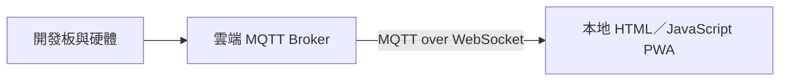
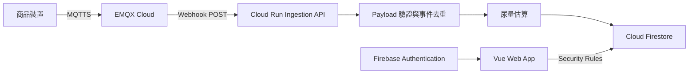
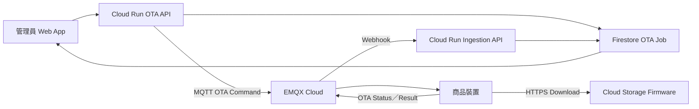

# IoT 硬體、MQTT 與 Web 雲端系統規格

- 文件版本：0.3
- 文件日期：2026-07-28
- 文件狀態：架構討論稿
- 文件範圍：目前原型與未來商品化目標

## 1. 文件目的

本文件整理目前已知的小型犬自動尿盆硬體、MQTT、Web App、Firebase 與資料儲存需求，並記錄未來商品化時需補充或決策的事項。

本文件不以推測補齊未知資訊。尚未確認的內容一律標示為：

- `TBD`：尚待決定或補充。
- `待釐清`：現有描述可能具有兩種以上解釋。
- `建議方案`：討論中提出但尚未確認採用的設計。

## 2. 系統目標

系統以 Arduino 開發板與液體感測器偵測小型犬排尿，偵測後控制抽水馬達自動沖水，並將水與尿液抽入容器。裝置把沖水時間、抽水時間與電池狀態傳送至已部署於雲端的 MQTT Broker，後端再根據時間與校正參數估算尿量，提供 Web App 顯示並永久保存歷史資料。

目前及未來目標包括：

1. 偵測寵物排尿並完成自動沖水與抽水流程。
2. 接收硬體經 MQTT 傳送的沖水時間、抽水時間、電量與裝置狀態。
3. 由後端根據抽水時間、沖水時間與校正參數估算尿量。
4. Web 端顯示估算尿量、排尿紀錄與電量。
5. 提供基本會員登入。
6. 永久保存歷史資料。
7. 提供資料統計與圖表。
8. 未來商品化後可識別不同實體裝置。
9. 使用者只能存取自己有權限查看的裝置資料。

## 3. 名詞

| 名詞 | 說明 |
| --- | --- |
| 裝置 | 目前指開發板及其控制的硬體；商品化後指單一實體商品 |
| Device ID | 系統用來識別單一裝置的唯一識別碼 |
| MQTT Broker | 接收、驗證、路由及轉送 MQTT 訊息的中介服務 |
| 排尿事件 | 液體感測器觸發後，裝置完成沖水與抽水流程所產生的一筆事件 |
| Telemetry | 裝置回傳的原始量測與狀態資料，目前包含沖水時間、抽水時間與電量 |
| 估算尿量 | 後端根據裝置回傳時間與校正參數計算的尿量估計值，不是裝置直接量測值 |
| Heartbeat | 裝置在沒有其他事件時主動回報仍可運作的狀態訊息；是否採用仍為建議方案 |
| Provisioning | 為裝置配置 Device ID、連線憑證及後端登錄資料的流程 |
| Claim | 會員將實體裝置綁定到自己帳號的流程 |

## 4. 已確認事項

### 4.1 目前原型

| 項目 | 已知內容 |
| --- | --- |
| 商品用途 | 小型犬自動尿盆 |
| 硬體型態 | Arduino 開發板、液體感測器、抽水馬達、18650 電池及儲液容器 |
| 硬體流程 | 偵測排尿後自動沖水，再將水與尿液抽入容器 |
| MQTT | MQTT 流程已完成，可將硬體資料傳送至 Web 端 |
| MQTT Broker 部署 | 已部署於 EMQX Cloud |
| Web | 本地端目前可執行 |
| 目前 Web 技術 | 純 HTML、CSS、JavaScript PWA；目前不是 Flutter 專案 |
| 目前資料流 | Web 透過 MQTT over WebSocket 直接訂閱 EMQX |
| 目前後端儲存 | 尚未建置 |
| MVP 前端方向 | Web App；暫不開發原生 iOS／Android App |
| MVP 後端方向 | Firebase Authentication、Cloud Firestore、Firebase Hosting 與 Cloud Run |
| MVP 接收流程 | EMQX → Webhook → Cloud Run |
| 主要回傳資料 | 沖水時間與抽水時間；由後端估算尿量 |
| 次要回傳資料 | 18650 電池電量 |

### 4.2 資料需求

| 項目 | 已知內容 |
| --- | --- |
| 原始排尿資料 | 沖水時間與抽水時間；傳輸單位與型別為 `TBD` |
| 尿量計算位置 | Cloud Run 後端 |
| 尿量計算公式 | `TBD`；需由抽水、沖水實測與校正結果決定 |
| 電量資料 | 以 25% 為一個級距；候選值為 0、25、50、75、100 |
| 歷史資料 | 要保存 |
| 保存期限 | 永久 |
| 統計功能 | 需要 |
| 圖表功能 | 需要 |
| 排尿資料回傳頻率 | 每次寵物排尿觸發並完成流程後回傳一筆 |
| 電量回傳頻率 | 電量跨越一個 25% 級距時回傳 |
| 每日 Heartbeat | 建議方案，尚未確認 |
| 原始資料與每日資料的關係 | 每筆事件永久保存，另外維護每日彙總 |

目前決定採用事件式保存，不進行固定頻率取樣：

1. 每次排尿完成後永久保存一筆原始事件。
2. 每次電量跨越級距時永久保存一筆電量事件。
3. 每日資料是統計彙總，不取代原始事件。
4. 若後續採用 Heartbeat，Heartbeat 亦獨立保存或只更新最新狀態，實際保存策略為 `TBD`。

## 5. 目前系統架構

目前原型的實際流程如下：



目前原型限制：

- MQTT Broker URL、共用 Username 與 Password 目前寫在前端程式中，不可直接公開部署；既有憑證需要輪替。
- Web 關閉後沒有服務接收或永久保存 MQTT 訊息。
- 目前沒有會員登入、裝置權限、歷史資料庫與每日統計。
- 目前前端使用模擬值顯示部分尿量資訊，尚未依沖水與抽水時間由後端計算。

## 6. 商品化目標架構

商品化時，資料永久保存不能依賴使用者瀏覽器保持開啟。MVP 採用 EMQX Webhook 將事件送至 Cloud Run，再由 Cloud Run 驗證、計算尿量並寫入 Cloud Firestore。



### 6.1 元件責任

| 元件 | 必要責任 |
| --- | --- |
| 商品裝置 | 偵測排尿、控制沖水與抽水、量測流程時間及電池狀態，並以唯一裝置身分發布事件 |
| MQTT Broker | 驗證裝置、依 Topic 路由訊息、處理 QoS、Session、Retained Message 與 Last Will 等 MQTT 能力 |
| EMQX Webhook | 依 Rule 將指定 Topic 的事件送到 Cloud Run；啟用 buffer、retry 與失敗監控 |
| Cloud Run Ingestion API | 驗證 Webhook、Topic、Device ID 與 Payload；去重；加入伺服器接收時間；計算估算尿量；寫入 Firestore |
| Firebase 後端 | 使用 Authentication、Cloud Firestore 與 Hosting 管理會員、裝置、資料與權限 |
| Vue Web App | 登入、顯示會員裝置、最新狀態、歷史資料、統計與圖表；不直接持有 MQTT 裝置憑證 |

### 6.2 MQTT Broker 的角色

MQTT Broker 的主要角色不是單純把 Arduino 資訊轉譯成 HTTP，而是：

1. 接收裝置發布的 MQTT 訊息。
2. 依 Topic 將訊息傳送給一個或多個訂閱者。
3. 將裝置與 Web、資料儲存、告警及其他服務解耦。
4. 支援從後端向裝置發送控制命令。
5. 依 QoS 提供不同程度的傳送保障。
6. 透過 Retained Message 提供指定 Topic 的最新狀態。
7. 透過 Last Will and Testament 協助判斷裝置異常離線。
8. 透過持久 Session 或離線佇列處理暫時離線的訂閱者。
9. 執行裝置驗證、Topic ACL、連線與訊息速率限制。
10. 視 Broker 能力，以 Rule Engine 或 Webhook 將訊息送至 HTTP Endpoint。

MQTT Broker 不作為永久歷史資料庫。歷史查詢、統計與圖表資料應由 Firebase 資料庫或其他正式資料庫負責。

## 7. MQTT 訊息規格

### 7.1 Topic

目前原型使用的 Topic 為：

```text
peecare/device/1/status
```

商品化的建議 Topic：

```text
products/{productModel}/devices/{deviceId}/events/urination
products/{productModel}/devices/{deviceId}/status/battery
products/{productModel}/devices/{deviceId}/status/heartbeat
products/{productModel}/devices/{deviceId}/status/availability
products/{productModel}/devices/{deviceId}/status/ota
products/{productModel}/devices/{deviceId}/commands/flush
products/{productModel}/devices/{deviceId}/commands/config
products/{productModel}/devices/{deviceId}/commands/ota
products/{productModel}/devices/{deviceId}/command-results
```

正式 Topic 命名與是否加入版本號仍為 `TBD`。

### 7.2 排尿事件 Payload

裝置不直接計算尿量。排尿事件需要把沖水時間與抽水時間送到 Cloud Run，由後端依校正參數計算估算尿量。

建議邏輯欄位：

| 欄位 | 型別 | 狀態 | 說明 |
| --- | --- | --- | --- |
| `schemaVersion` | Integer | 建議方案 | Payload Schema 版本 |
| `eventId` | String | 建議方案 | 單筆事件唯一識別碼；裝置重送時維持不變 |
| `eventType` | String | 建議方案 | 排尿事件固定為 `urination` |
| `deviceId` | String | 建議方案 | 裝置識別碼；仍應與已驗證連線及 Topic 交叉驗證 |
| `sequence` | Integer | 建議方案 | 裝置遞增序號，用於偵測漏訊及去重 |
| `flushDurationMs` | Integer | 建議欄位 | 本次沖水時間；候選單位為毫秒，正式單位為 `TBD` |
| `pumpDurationMs` | Integer | 建議欄位 | 本次抽水時間；候選單位為毫秒，正式單位為 `TBD` |
| `recordedAt` | Timestamp | 建議方案 | 裝置端事件時間 |
| `firmwareVersion` | String | 建議方案 | 韌體版本 |

Payload 範例：

```json
{
  "schemaVersion": 1,
  "eventId": "TBD",
  "eventType": "urination",
  "deviceId": "PC-000001",
  "sequence": 0,
  "flushDurationMs": 0,
  "pumpDurationMs": 0,
  "recordedAt": 0,
  "firmwareVersion": "0.1.0"
}
```

後端處理後應增加：

| 欄位 | 型別 | 狀態 | 說明 |
| --- | --- | --- | --- |
| `estimatedUrineMl` | Number | 已確認需求 | 後端根據沖水與抽水時間計算的估算尿量 |
| `calibrationVersion` | Integer／String | 建議方案 | 本次計算使用的校正公式版本 |
| `receivedAt` | Timestamp | 建議方案 | Cloud Run 接收時間 |

尿量公式、沖水量扣除方式、校正程序、合理範圍與異常值規則均為 `TBD`。即使後端已算出 `estimatedUrineMl`，仍需永久保存 `flushDurationMs` 與 `pumpDurationMs`，讓公式更新後可以重新計算。

### 7.3 電量與 Heartbeat Payload

電池在跨越 25% 級距時回傳。建議同時在開機與 MQTT 重新連線時回傳目前級距，並對級距切換加入 hysteresis 或連續讀值確認，避免臨界電壓造成 25%／50% 反覆切換。

電量事件候選 Payload：

```json
{
  "schemaVersion": 1,
  "eventId": "TBD",
  "eventType": "battery",
  "deviceId": "PC-000001",
  "sequence": 0,
  "batteryLevelPercent": 75,
  "batteryVoltageMv": 0,
  "recordedAt": 0,
  "firmwareVersion": "0.1.0"
}
```

`batteryVoltageMv` 是建議保留的原始電壓；硬體是否可取得、傳輸單位及是否納入 MVP 為 `TBD`。

若採用每日 Heartbeat，候選 Payload：

```json
{
  "schemaVersion": 1,
  "eventId": "TBD",
  "eventType": "heartbeat",
  "deviceId": "PC-000001",
  "sequence": 0,
  "batteryLevelPercent": 75,
  "recordedAt": 0,
  "firmwareVersion": "0.1.0"
}
```

Arduino 是否持續連接 Wi-Fi／MQTT、是否休眠，以及 Heartbeat 週期均為 `TBD`。

### 7.4 QoS、重送與訊息行為

| 項目 | 狀態 |
| --- | --- |
| Telemetry QoS | `TBD` |
| Status QoS | `TBD` |
| Command QoS | `TBD` |
| Retained Message 使用方式 | `TBD` |
| Persistent Session／Session Expiry | `TBD` |
| Last Will Topic 與 Payload | `TBD` |
| Arduino 是否持續連接 Wi-Fi／MQTT | `TBD` |
| 訊息重送 | 建議裝置保留尚未確認的事件並以相同 `eventId` 重送 |
| 後端去重 | Cloud Run 以 `eventId` 作為 Firestore Event Document ID，重複事件不得重複累加統計 |
| Webhook 成功條件 | Cloud Run 成功寫入 Firestore 後才回傳 `2xx` |
| Webhook 暫時性失敗 | 回傳 `5xx`，由 EMQX buffer／retry 重試 |
| Webhook 無效 Payload | 回傳 `4xx` 並留下錯誤紀錄，避免無限重試 |

## 8. Device ID 與裝置身分

### 8.1 必要原則

商品化後，每台裝置必須可以被唯一識別。Device ID 用於識別資料來源，但 Device ID 本身不應視為安全憑證。

### 8.2 Device ID 來源

目前開發板與 MCU 型號未知，因此尚不能確認是否可使用原廠寫入的硬體 Unique ID。

可能方案：

1. 由 MCU 的 eFuse、Unique Device ID、Base MAC 或外接 Flash Unique ID 衍生。
2. 由生產系統為每塊 PCBA 產生並寫入 Device ID。
3. PCBA 交付後，由自有燒錄／Provisioning 工具逐台寫入。

正式選擇為 `TBD`。

### 8.3 Device ID、序號與憑證

以下資訊應分開管理：

| 資訊 | 用途 | 是否可公開 |
| --- | --- | --- |
| MCU Unique ID | 硬體層唯一資訊 | 原則上不直接公開 |
| Device ID | MQTT Topic、API 與資料庫識別 | 可公開 |
| 商品序號 | 保固、生產、訂單及客服 | 可公開 |
| MQTT Username | 裝置登入名稱 | 不應作為秘密 |
| MQTT Password／Private Key | 裝置驗證 | 不可公開 |
| Claim Code | 首次綁定裝置 | 綁定前不可公開給非持有人 |

Device ID 與商品序號是否共用同一值為 `TBD`。

## 9. 裝置驗證與 MQTT 權限

### 9.1 憑證

商品化時，不應讓所有裝置共用同一組 MQTT 帳號密碼。

建議方案：

- 初期：每台裝置使用獨立 MQTT Username／Password，並使用 TLS。
- 成熟量產：評估每台裝置獨立 X.509 Client Certificate 及 Secure Element。

正式驗證方式、密碼長度、憑證輪替與撤銷流程均為 `TBD`。

### 9.2 Topic ACL

建議每台裝置只能發布自己的 Telemetry／Status，並只能訂閱自己的 Command／Config。

概念規則：

```text
裝置 DEV-A 只可 Publish：
products/{model}/devices/DEV-A/events/urination
products/{model}/devices/DEV-A/status/battery
products/{model}/devices/DEV-A/status/heartbeat
products/{model}/devices/DEV-A/status/availability
products/{model}/devices/DEV-A/status/ota
products/{model}/devices/DEV-A/command-results

裝置 DEV-A 只可 Subscribe：
products/{model}/devices/DEV-A/commands/flush
products/{model}/devices/DEV-A/commands/config
products/{model}/devices/DEV-A/commands/ota
```

實際 ACL 語法依 MQTT Broker 而定，目前為 `TBD`。

## 10. 會員與裝置綁定

### 10.1 會員

MVP 建議使用 Firebase Authentication 提供基本會員登入。下列細節尚待確認：

- 登入方式：Email／密碼、Google、Apple 或其他。
- 密碼重設與 Email 驗證需求。
- 管理者角色及後台需求。

### 10.2 裝置綁定

商品化的建議流程：

1. 使用者登入 Web App。
2. 掃描商品 QR Code 或輸入 Device ID 與 Claim Code。
3. 後端驗證裝置未被其他會員綁定。
4. 後端建立會員 UID 與 Device ID 的所有權關聯。
5. Claim Code 失效或輪替。
6. Web 只允許會員查看自己擁有的裝置。

以下事項為 `TBD`：

- 是否採用 Claim Code。
- 是否以 QR Code 執行綁定。
- 一名會員可綁定的裝置數量。
- 一台裝置是否可分享給多名會員。
- 解除綁定、轉移、二手商品及維修換板流程。

### 10.3 Wi-Fi Provisioning 與首次綁定

MVP 建議採用「裝置 SoftAP＋本機設定頁面」完成 Wi-Fi Provisioning，並以「QR Code＋一次性 Claim Code」完成會員綁定。此方案不要求先開發原生 iOS／Android App；Web App 負責會員登入、掃描 QR Code 及顯示設定進度，Wi-Fi SSID 與密碼則由裝置提供的本機頁面接收。

Wi-Fi Provisioning 與 Claim 是兩個不同流程：

- Wi-Fi Provisioning：將使用者家中的 Wi-Fi SSID 與密碼安全交給裝置。
- Claim：將已生產登錄的 Device ID 與 Firebase Authentication User UID 建立所有權關聯。

建議的出廠前置條件：

1. 每台裝置已寫入唯一 Device ID。
2. 每台裝置已寫入獨立 MQTT Credential，不與其他裝置共用。
3. 後端已建立狀態為 `unclaimed` 的裝置紀錄。
4. 每台裝置已產生一次性 Claim Code，後端只保存其雜湊。
5. 商品盒內、說明卡或刮刮膜下提供包含 Device ID 與 Claim Code 的 QR Code；不可把仍有效的 Claim Code 暴露在任何人皆可掃描的外箱表面。

建議的買家設定流程：

1. 使用者登入 PeeCare Web App。
2. 使用者掃描 QR Code，或手動輸入 Device ID 與 Claim Code。
3. Web App 將 Device ID、Claim Code 與 Firebase ID Token 傳送至 Cloud Run Claim API。
4. Claim API 以原子操作驗證裝置存在、Claim Code 正確且尚未使用、裝置未被其他會員綁定。
5. 驗證成功後，後端建立 `pending` 的會員與裝置關聯；Claim Code 立即失效或標記為已使用。
6. 使用者長按裝置配對鍵，使裝置進入有時間限制的 Provisioning 模式並開啟臨時 SoftAP，例如 `PeeCare-000001`。
7. 手機連上裝置 SoftAP，開啟裝置提供的本機設定頁面，選擇家中 SSID 並輸入 Wi-Fi 密碼。
8. Wi-Fi 密碼只在手機與裝置之間傳遞，不送至 PeeCare Web App、Cloud Run、Firestore 或日誌。
9. 裝置安全保存 Wi-Fi 設定，關閉 SoftAP，連上家中 Wi-Fi，再以自身 MQTTS Credential 連線 EMQX。
10. 裝置發布首次上線或 Provisioning 完成事件。
11. EMQX Webhook 將事件送至 Cloud Run；後端交叉驗證 MQTT 連線身分、Topic 與 Device ID。
12. 驗證成功後，後端將綁定狀態由 `pending` 改為 `active`，並更新裝置最後上線時間。
13. Web App 透過 Firestore 即時顯示設定成功；若逾時未上線，保留可重試或取消的 `pending` 狀態。

建議綁定狀態：

```text
unclaimed → pending → active
                 ↘ expired／cancelled
```

安全與生命週期原則：

- Claim 必須由具管理權限的 Cloud Run API 執行，不讓前端直接修改 Firestore 的 Owner UID 或 Membership。
- Device ID 只用於識別，不能取代 Claim Code、MQTT Password 或 Private Key。
- EMQX 必須以每台裝置的身分及 Topic ACL 驗證首次上線事件。
- Provisioning 模式應由實體按鍵或等效的近端動作觸發，並有逾時、自動關閉及重試限制。
- 工廠重設可以清除 Wi-Fi 設定，但不得自動移除雲端所有權；解除綁定、二手轉移與維修換板必須使用另外定義的後端流程。

SoftAP 的啟動方式、臨時網路驗證、本機設定頁面的傳輸保護、Provisioning 逾時、Claim Pending 期限與失敗重試規則均為 `TBD`。若最終 MCU 支援 BLE，可再評估 BLE Provisioning；是否採用不影響 Claim API 與會員資料模型。

## 11. Firebase、Cloud Run 與 Web 部署

### 11.1 MVP 決策與建議

- 暫時只開發 Web App，不開發原生 iOS／Android App。
- 目前本地原型是 HTML、CSS、JavaScript PWA，不是 Flutter。
- MVP 前端建議改為 Vue 3、TypeScript 與 Vite。
- MVP 後端採用 Firebase Authentication、Cloud Firestore 與 Firebase Hosting。
- MQTT 接收採用 EMQX → Webhook → Cloud Run。
- Web App 不直接連接 MQTT，改由 Firestore 即時更新畫面。
- Realtime Database、Firebase SQL Connect、Supabase、時序資料庫與 Pub/Sub 暫不加入 MVP。

選擇 Firestore 的主要理由：

1. 資料是排尿觸發的低頻事件，而不是每秒多筆的連續時序串流。
2. MVP 需要會員登入、即時顯示、歷史資料與裝置權限，Firebase 整合成本較低。
3. 每筆排尿事件永久保存，再以每日彙總提供首頁與圖表，不需每次讀取全部原始事件。
4. 若未來裝置達數萬台或需要複雜跨裝置分析，再評估 PostgreSQL、BigQuery 或其他分析資料庫。

### 11.2 服務分工

| 功能 | 服務 | 決策 |
| --- | --- | --- |
| Vue Web App 部署 | Firebase Hosting | MVP 建議採用 |
| 會員登入 | Firebase Authentication | MVP 建議採用 |
| 最新狀態、歷史事件與每日統計 | Cloud Firestore | MVP 建議採用 |
| MQTT Webhook Endpoint | Cloud Run | 已確認 |
| Claim API 與裝置控制 API | Cloud Run | 商品化建議方案 |
| 後端發布 MQTT Command | EMQX Publish／Management API 或專用 MQTT Client | 建議方案；實際方式 `TBD` |
| Webhook Secret | Google Secret Manager | 建議方案 |
| OTA 韌體檔案與 Manifest | Cloud Storage | 採用 OTA 時的建議方案 |
| 圖片或附件 | Cloud Storage | 目前無已知需求 |
| 非同步訊息佇列 | Google Cloud Pub/Sub | MVP 暫不採用；可靠性需求提高時再評估 |

### 11.3 EMQX Webhook 到 Cloud Run

Cloud Run Ingestion API 的責任：

1. 驗證 HTTP Method、Content-Type、Payload 大小與 Webhook Secret。
2. 驗證 MQTT Topic、裝置連線身分與 Payload 中的 Device ID 一致。
3. 驗證沖水時間、抽水時間、電量、Sequence 與時間戳記的型別及合理範圍。
4. 以 `eventId` 去重。
5. 依校正版本，使用 `flushDurationMs` 與 `pumpDurationMs` 計算 `estimatedUrineMl`。
6. 加入 `receivedAt`。
7. 寫入原始事件、裝置最新狀態與每日彙總。
8. 寫入成功後才回傳 `2xx`。

Cloud Run Endpoint 可能需要允許來自 EMQX Cloud 的公開網路請求，因此不可只靠 URL 保密。MVP 建議由 EMQX 加入自訂 Authorization Header，Cloud Run 使用 Secret Manager 中的 Secret 驗證。實際 Header 格式、Secret 輪替、Rate Limit 與來源限制為 `TBD`。

EMQX Webhook Action 建議啟用 buffer／retry，並監控 `failed`、`dropped`、`queue_full` 與 `expired`。實際 Request TTL、Buffer 大小及告警門檻為 `TBD`。

### 11.4 成本控制與實作提醒

Cloud Run Ingestion 與 Firestore 在 MVP 的低頻事件量下預期可優先使用免費額度，但啟用 Billing 後，超出免費額度的用量仍會自動計費。Budget Alert 只負責通知，不會自動停止服務，因此後續實作與上線前必須同時考慮下列事項：

1. Cloud Run 採 request-based billing，MVP 的 minimum instances 設為 `0`，並設定合理的 memory、timeout、concurrency 與 maximum instances，避免閒置執行個體或異常流量持續產生成本。
2. Cloud Run 與 Firestore 優先部署在同一 Region，避免跨區資料傳輸費用及不必要的延遲；正式 Region 仍為 `TBD`。
3. EMQX retry 可能重複送達同一事件。Ingestion 必須先以 `eventId` 去重，並以原子操作更新原始事件、最新狀態與每日彙總，避免重試造成重複寫入及統計錯誤。
4. 首頁與長區間圖表優先讀取裝置最新狀態及每日彙總，不得為每次顯示重新掃描全部原始事件。
5. 歷史紀錄查詢必須設定時間範圍、排序、`limit` 及 cursor pagination；避免使用 offset pagination，因為被略過的 Firestore Document 仍可能計入讀取量。
6. Firestore 即時 Listener 只訂閱畫面當下需要的資料，離開頁面或切換裝置時必須解除訂閱。重新連線、查詢結果更新及 Security Rules 的相依 Document 都可能增加讀取次數。
7. Security Rules 應在維持正確授權的前提下，減少每次請求需要額外讀取的 Membership 或角色 Document；實作前需以 Emulator 與實際查詢驗證讀取行為。
8. Secret Manager 的 Secret 不應在每筆事件中重複遠端讀取；應使用 Cloud Run 的 Secret 掛載或在執行個體生命週期內安全重用，並控制有效 Secret Version 數量。
9. Cloud Logging 應避免記錄完整 Payload、憑證或高頻成功事件；需定義錯誤日誌、抽樣、保存期限及告警規則，避免日誌量與敏感資料外洩。
10. Firestore Backup、PITR、TTL、Restore 與額外 Database 不包含在一般免費額度內；啟用前必須另行估算成本及確認保存需求。
11. 上線前必須建立 Billing Budget、用量告警與 Cloud Run／Firestore 監控 Dashboard，並定期依裝置數、事件數、讀寫次數、儲存量及網路流量重新估算成本。

## 12. 資料模型

MVP 建議使用 Cloud Firestore。以下為候選實體模型，仍需在實作前以 Security Rules 與查詢需求驗證。

### 12.1 User

| 欄位 | 狀態 |
| --- | --- |
| User UID | 需要 |
| Email／登入識別 | 需要，實際形式 `TBD` |
| 角色 | `TBD` |
| 建立時間 | 建議方案 |

### 12.2 Device

| 欄位 | 狀態 |
| --- | --- |
| Device ID | 商品化需要 |
| Owner UID | MVP 需要 |
| Product Model | `TBD` |
| 顯示名稱 | 建議方案 |
| 韌體版本 | 建議方案 |
| 尿量校正版本與參數 | 需要；實際模型為 `TBD` |
| 最新估算尿量 | 需要 |
| 最新電量級距 | 需要 |
| 最近排尿時間 | 需要 |
| 最後回報時間 | 建議方案 |
| 在線狀態 | `TBD`；受裝置是否持續連接 Wi-Fi／MQTT 影響 |
| 綁定狀態 | 商品化需要 |
| Provisioning 狀態 | 建議方案；例如未設定、等待上線、完成或失敗 |
| OTA 狀態與目標版本 | 採用 OTA 時建議保存 |
| 生產批次 | `TBD` |

### 12.3 Device Membership

候選 Collection：`deviceMemberships/{deviceId_uid}`

| 欄位 | 狀態 |
| --- | --- |
| Device ID | 需要 |
| User UID | 需要 |
| Role | 建議方案；例如 Owner、Member、Viewer |
| 建立時間 | 建議方案 |

即使 MVP 先採單一擁有者，也建議保留 Membership 模型，以支援家庭成員、寵物保姆、獸醫暫時查看、二手轉移與解除綁定。

### 12.4 Event Record

候選路徑：`devices/{deviceId}/events/{eventId}`

| 欄位 | 狀態 |
| --- | --- |
| Device ID | 需要 |
| Event ID | 建議方案；同時作為 Document ID |
| Event Type | 需要；Urination、Battery 或 Heartbeat |
| Sequence | 建議方案 |
| 沖水時間 | 排尿事件需要，`flushDurationMs` |
| 抽水時間 | 排尿事件需要，`pumpDurationMs` |
| 估算尿量 | 排尿事件由後端計算，`estimatedUrineMl` |
| 校正版本 | 建議方案 |
| 電量級距 | Battery／Heartbeat 需要 |
| 電池電壓 | 硬體可取得時建議保存 |
| 裝置事件時間 | 建議方案 |
| 伺服器接收時間 | 建議方案 |
| 韌體版本 | 建議方案 |

### 12.5 Daily Aggregate

候選路徑：`devices/{deviceId}/dailyStats/{yyyy-MM-dd}`

每日資料是由原始排尿事件產生的彙總，不取代原始事件。候選欄位：

- 日期。
- 排尿次數。
- 估算尿量總和。
- 平均估算尿量。
- 最小估算尿量。
- 最大估算尿量。
- 當日最後電量級距。
- 最後更新時間。

每日分界時區、延遲事件處理方式與統計修正策略為 `TBD`。

## 13. 統計與圖表

已確認需要統計與圖表，但細節為 `TBD`：

- 圖表種類。
- 查詢時間範圍。
- 資料顯示粒度；首頁與長區間圖表優先讀取每日彙總。
- 排尿事件明細與每日彙總的切換方式。
- 估算尿量與電量是否顯示在同一圖表。
- 時區與每日資料切分方式。
- 資料匯出需求。
- 即時更新需求。

## 14. PCBA、韌體燒錄與量產

### 14.1 自行燒錄

PCBA 完成後可由委託方自行燒錄韌體，前提是 PCB 設計已預留適用於所選 MCU 的燒錄、供電、Reset、Boot 與除錯介面。

實際介面依 MCU 決定，目前為 `TBD`，可能包括：

- UART。
- SWD。
- JTAG。
- USB Bootloader／DFU。
- ISP。

### 14.2 建議的初期流程

下列為建議方案，尚未確認採用：

1. 代工廠完成 PCBA 與基本電氣測試。
2. 板上預留適合 Pogo Pin 的 Test Point 與定位結構。
3. 由委託方使用治具燒錄正式韌體。
4. 讀取 MCU 硬體 Unique ID。
5. 產生或取得 Device ID。
6. 寫入每台獨立的 MQTT Credential。
7. 在後端建立裝置紀錄。
8. 執行 Wi-Fi、MQTT、量測與硬體功能測試。
9. 產生並貼上 Device ID／Claim QR Code。
10. 將裝置標記為可出貨。

### 14.3 韌體與裝置專屬資料分區

建議將所有裝置共用的韌體與每台不同的資料分開：

```text
共同區域
├── Bootloader
├── Partition Table
└── Application Firmware

裝置專屬區域
├── Device ID
├── MQTT Credential
├── Provisioning 狀態
└── 校正資料
```

實際 Partition、NVS 或安全儲存方式依 MCU 而定，目前為 `TBD`。

### 14.4 代工廠責任

是否由代工廠負責下列事項均為 `TBD`：

- 燒錄測試韌體。
- 燒錄正式韌體。
- 逐台寫入 Device ID。
- 逐台寫入 MQTT Credential。
- 讀取並回傳 MCU Unique ID。
- 製作燒錄與功能測試治具。
- 執行 ICT／FCT。
- 列印及配對 QR Code。
- 保存或刪除韌體與裝置憑證。

## 15. 韌體更新與裝置維護

### 15.1 Web App 與 OTA 的責任邊界

商品化架構可以讓 Web App 發起遠端韌體更新，但 Web App 不直接把韌體寫入裝置。Web App 是控制與狀態介面；Cloud Run 負責驗證權限及建立更新工作；EMQX 負責傳送更新命令；裝置韌體負責下載、驗證、安裝、重啟與失敗回復。

更新不能依賴使用者瀏覽器保持開啟。Web App 關閉後，已建立的 OTA Job 仍應由後端與裝置繼續執行，進度及結果保存於 Firestore。

建議架構：



一般會員是否可選擇立即更新、延後更新或只查看狀態為 `TBD`。建議只有管理員或受控的發布系統可以上傳韌體與建立版本；一般會員不得上傳或指定任意韌體檔案。

### 15.2 建議 OTA 流程

1. 管理員上傳已簽章的韌體與 Manifest，後端記錄版本、支援的 Product Model、檔案雜湊、大小、簽章與發布狀態。
2. 管理員在 Web 後台選擇韌體版本、目標裝置或分批發布條件。
3. Cloud Run OTA API 驗證 Firebase 身分、管理員角色、裝置型號與版本相容性，建立 OTA Job。
4. 後端透過 EMQX 發布裝置專屬的 OTA Command；MQTT 命令只攜帶版本、下載位置、雜湊、簽章資訊及工作識別碼，不透過 MQTT 傳送整個韌體檔案。
5. 裝置收到命令後檢查目前是否允許更新，例如電量高於門檻、馬達未運作且沒有其他硬體流程進行中。
6. 裝置透過 HTTPS 下載韌體，並驗證 Product Model、版本、檔案大小、雜湊及數位簽章。
7. 驗證成功後，裝置將韌體寫入非目前啟動的 Application Partition，保留 Device ID、MQTT Credential、Wi-Fi 設定、Provisioning 狀態與校正資料。
8. 裝置回報準備重啟，切換至新韌體並執行啟動自我檢查。
9. 新韌體在限定時間內完成開機、基本硬體檢查及 MQTT 連線後，才將新版本標記為有效。
10. 若下載、驗證、寫入、開機或自我檢查失敗，裝置回復至上一個可用版本並回報失敗原因。
11. OTA 狀態透過 MQTT 回報至 EMQX，再由 Webhook、Cloud Run 寫入 Firestore，Web App 從 Firestore 顯示進度與最終結果。

建議 OTA Command 邏輯欄位：

| 欄位 | 說明 |
| --- | --- |
| `schemaVersion` | OTA Command Schema 版本 |
| `jobId` | 單次 OTA 工作唯一識別碼 |
| `targetVersion` | 目標韌體版本 |
| `productModel` | 適用商品型號 |
| `downloadUrl` | 有效期限受限的 HTTPS 下載位置 |
| `fileSizeBytes` | 韌體檔案大小 |
| `sha256` | 韌體檔案雜湊 |
| `signature`／`signatureKeyId` | 韌體簽章及驗證金鑰識別 |
| `expiresAt` | 命令或下載位置失效時間 |

建議 OTA 狀態至少包括：

```text
queued → downloading → verifying → installing → rebooting → success
                 ↘ rejected／failed／rolled_back
```

實際 Payload Schema、狀態轉換、進度回報頻率、下載 URL 形式、簽章演算法與金鑰輪替方式均為 `TBD`。

### 15.3 裝置與硬體必要條件

是否能採用上述流程取決於最終 MCU、Bootloader、Flash 容量與 Partition 設計。商品硬體至少需評估：

- MCU、Bootloader 與 SDK 是否支援 OTA。
- Flash 是否足以保存目前版本、新版本及必要的回復資訊。
- 雙 Application Partition 或等效的安全更新與回復機制。
- 韌體數位簽章驗證；版本號或雜湊本身不能取代簽章。
- 更新期間的最低電量、供電穩定性及馬達互鎖規則。
- 斷電、網路中斷、檔案損毀及新韌體無法啟動時的復原行為。
- Device ID、MQTT Credential、Wi-Fi、Provisioning 狀態與校正資料使用獨立且不被 OTA 覆蓋的儲存區域。

### 15.4 其他裝置維護能力

以下商品化能力仍待確認：

- Secure Boot。
- Flash Encryption。
- JTAG／Debug Port 鎖定。
- MQTT Credential 輪替。
- 遺失或遭竊裝置撤銷。
- 工廠重設。
- 維修換板後的 Device ID 與商品序號關聯。

不可逆的 eFuse、安全鎖定或 Readout Protection 應在完整燒錄、Provisioning、連線及 OTA 測試成功後才執行；實際流程需依 MCU 規格另外定義。

## 16. 非功能性需求

| 類別 | 狀態 |
| --- | --- |
| 系統可用性 | `TBD` |
| 可接受資料遺失率 | `TBD` |
| MQTT 斷線重連 | 需要，細節 `TBD` |
| 離線資料緩存 | `TBD` |
| 訊息去重 | 需要；以 `eventId` 實作，細節 `TBD` |
| Webhook 驗證 | 需要；MVP 建議使用自訂 Authorization Header 與 Secret Manager |
| EMQX Webhook Buffer／Retry | 需要，Request TTL、Buffer 與告警門檻為 `TBD` |
| 傳輸加密 | 商品化建議使用 TLS，是否已啟用為 `TBD` |
| 靜態資料加密 | `TBD` |
| 稽核紀錄 | `TBD` |
| 資料備份與還原 | `TBD` |
| 時區 | `TBD`；Web 主要使用地預期為台灣，但每日分界尚未正式確認 |
| 裝置在線定義 | `TBD`；需先決定 Arduino 是否持續連接 Wi-Fi／MQTT |
| Heartbeat | 建議每日或開機／重連時回傳，尚未確認 |
| OTA 安全與回復 | 採用 OTA 時需要韌體簽章驗證、斷電安全與失敗回復；細節 `TBD` |
| 預期裝置數量 | `TBD` |
| 預期會員數量 | `TBD` |
| 成本上限 | 初期希望優先使用免費額度；確切上限 `TBD` |

## 17. 待確認清單

### 17.1 硬體與韌體

- [ ] 開發板名稱。
- [ ] MCU 型號。
- [ ] 最終商品 MCU 是否與原型相同。
- [ ] 可用的硬體 Unique ID。
- [ ] 燒錄與除錯介面。
- [ ] Device ID 生成方式。
- [ ] Device Credential 儲存方式。
- [ ] Arduino 是否持續連接 Wi-Fi／MQTT，或只在事件發生時喚醒連線。
- [ ] 裝置端未送達事件的持久緩存與重送方式。
- [ ] 18650 電壓到 25% 級距的換算與 hysteresis。
- [ ] MCU、Bootloader、Flash 與 Partition 是否支援具回復能力的 OTA。
- [ ] OTA 最低電量、馬達互鎖、斷電回復與啟動自我檢查規則。
- [ ] 韌體簽章演算法、驗證金鑰保存與金鑰輪替方式。
- [ ] Secure Boot、Flash Encryption 與除錯介面鎖定策略。

### 17.2 MQTT

- [x] MQTT Broker 使用 EMQX Cloud。
- [ ] MQTT Broker 部署平台與區域。
- [ ] Arduino 使用 MQTT、MQTTS 或 MQTT over WebSocket。
- [ ] MQTT Topic。
- [ ] MQTT Payload。
- [x] 排尿事件在每次排尿流程完成後回傳。
- [x] 電量在跨越 25% 級距時回傳。
- [ ] Heartbeat 是否採用及週期。
- [ ] QoS、Retain、Last Will 與 Session 設定。
- [x] MVP 採用 EMQX → Webhook → Cloud Run。
- [ ] EMQX Webhook Buffer、Retry、Request TTL 與失敗告警設定。
- [ ] MQTT ACL 與每台裝置的驗證方式。

### 17.3 Firebase 與 Web

- [x] MVP 後端方向為 Firebase Authentication、Cloud Firestore、Firebase Hosting 與 Cloud Run。
- [x] 暫時只做 Web App，不開發原生 App。
- [ ] Vue 3、TypeScript 與 Vite 的正式前端技術確認。
- [x] MQTT 訊息由 Cloud Run 驗證、計算並寫入 Firestore。
- [ ] Cloud Run Webhook Header、Secret 輪替與 Rate Limit。
- [ ] Cloud Run Claim API、Claim Code 雜湊及原子綁定流程。
- [ ] Cloud Run OTA API、管理員角色與後端 MQTT Command 發布方式。
- [ ] OTA Firmware／Manifest 的 Cloud Storage 路徑、版本與存取控制。
- [ ] 會員登入方式。
- [ ] Firebase Security Rules。
- [ ] 管理後台及角色需求。
- [ ] Cloud Run 與 Firestore 的 Region、minimum／maximum instances、timeout、concurrency 與資源上限。
- [ ] Firestore 查詢的時間範圍、limit、cursor pagination、Listener 生命週期與 Security Rules 額外讀取成本。
- [ ] Billing Budget、用量告警、監控 Dashboard、日誌抽樣與保存期限。
- [ ] Backup、PITR、TTL、Restore 與額外 Database 的必要性及成本。

### 17.4 資料

- [x] 裝置回傳沖水時間與抽水時間，由後端估算尿量。
- [ ] 沖水時間與抽水時間的單位、合理範圍與異常值規則。
- [ ] 尿量換算公式、校正流程、校正版本與裝置差異。
- [ ] 電量級距與原始電壓的資料格式、範圍與異常值規則。
- [x] 每筆排尿及電量事件永久保存，每日資料為另外產生的彙總。
- [ ] 每日彙總的時區、欄位、延遲事件與修正策略。
- [ ] 永久保存的備份、封存與成本策略。
- [ ] 統計公式、圖表、查詢區間與資料粒度。

### 17.5 商品化

- [ ] 商品型號與序號規則。
- [ ] Claim Code 及 QR Code 流程。
- [ ] SoftAP 啟動方式、臨時網路驗證、本機設定頁面與 Provisioning 逾時。
- [ ] Provisioning `pending` 期限、取消與失敗重試規則。
- [ ] 一名會員與多台裝置的關係。
- [ ] 裝置分享、解除綁定與所有權轉移。
- [ ] 代工廠與委託方的燒錄及測試責任。
- [ ] Provisioning 工具與生產資料格式。
- [ ] 維修、換板、報廢及憑證撤銷流程。

## 18. 下一步

MVP 建議依下列順序繼續：

1. 以實機測試建立 `flushDurationMs`、`pumpDurationMs` 與實際尿量的校正資料。
2. 決定 Arduino 的 Wi-Fi／MQTT 連線與省電策略，再定義 Heartbeat、Last Will 與在線狀態。
3. 確認 MQTT Topic、Payload、QoS、重送、Event ID 與 Sequence 規格。
4. 建立 Cloud Run Ingestion API 與 EMQX Webhook，先完成驗證、去重、尿量計算和 Firestore 寫入。
5. 建立 Firebase Authentication、Firestore Schema、Security Rules 與本地 Emulator 測試。
6. 確認 Vue 3、TypeScript、Vite，並把目前 PWA 改為只讀取 Firestore，不再直接連 MQTT。
7. 建立首頁最新狀態、排尿歷史與每日統計。
8. 定義生產 Provisioning 資料格式，實作 SoftAP 配網、Claim API、一次性 Claim Code 與首次上線確認流程。
9. 選定支援安全 OTA 的 MCU、Bootloader 與 Partition 設計，完成簽章驗證、斷電測試及失敗回復測試後，再實作 Web OTA 管理流程。
10. 依實際裝置數、事件數、OTA 流量與保存策略重新估算 Firebase、Cloud Run、Cloud Storage 與 EMQX 成本。

後續每確認一項待辦，應將對應 `TBD` 改為確定內容並記錄決策日期與原因；若影響介面、商品生產或成本，需同步更新 Topic、Payload、Schema、流程圖、Provisioning 與測試流程。
